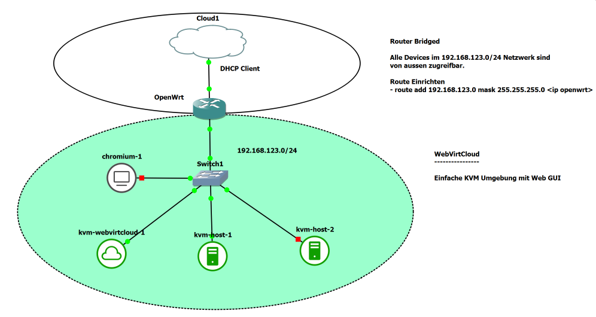
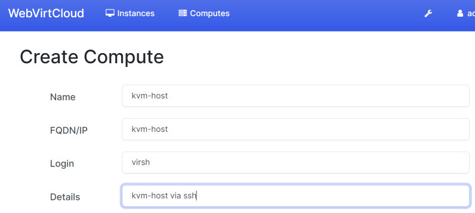
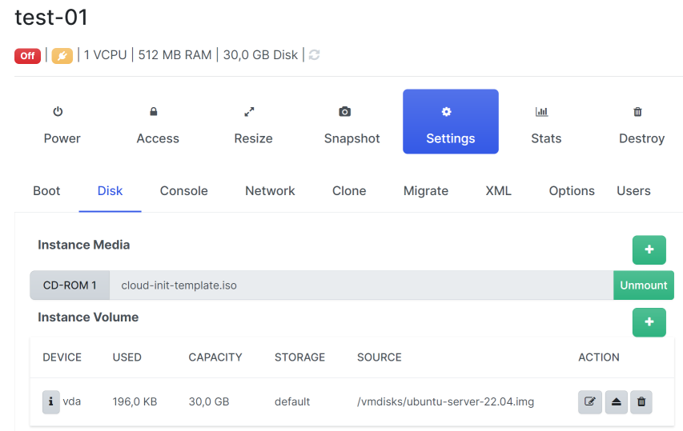
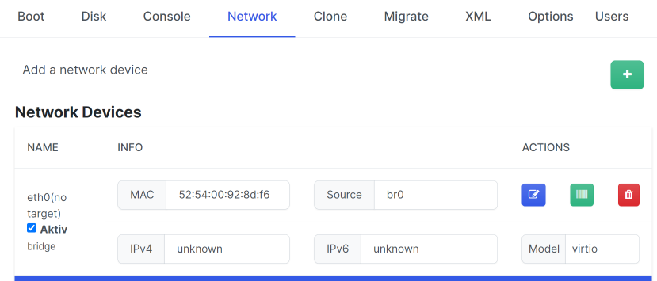

KVM Umgebung mit WebVirtCloud
=============================

- - -

Die Umgebung besteht aus einer VM mit WebVirtCloud und drei KVM-Hosts.

WebVirtCloud stellt ein Web GUI zur Verfügung, mittels diesem auf den KMV-Hosts VMs erstellt werden können.

WebVirtCloud
------------

WebVirtCloud besitzt eine Weboberfläche welche mittels `http://<ip vm>` erreichbar ist.

Anmelden mit User und Password `admin`.

Dannach als erstes -> Admin -> Profile -> Name, Mail setzen und Password ändern! Wird das Password nicht geändert, können undefinierte Fehler auftreten.

**Compute (KVM-Host) einbinden**

- - -

Dazu ist der SSH-Key vom User `www-data` von der `webvirtcloud` VM auf die jeweiligen `KVM-Hosts` zu kopieren.

    sudo -u www-data ssh-copy-id virsh@kvm-host
    
Password: `insecure`. Evtl. Warning können ignoriert werden.

Dannach über die Weboberfläche -> Compute -> SSH die KVM-Host einbinden. Mit den anderen Protokollen konnte keine Verbindung hergestellt werden.    

### Erste VM erstellen

- - -

Instance (VM) durch drücken von '+' erstellen.

- - -

Nach dem Erstellen Disk `ubuntu-server-22.img` zuweisen und CD-ROM `cloud-init-template.iso` mounten.

- - -

Soll die VM im Netzwerk von Router sichtbar sind ist als Network Interface `br0` einzustellen.

### Weitere VMs erstellen

Weitere Images können entweder mittels den normalen Installation CD-ROM der entsprechnenden Betriebsysteme erstellt werden,  oder mittels Cloud-init.

Bei Cloud-init ist zuerst ein neuer Disk, abgeleitet von `jammy-server-cloudimg-amd64.img`, zu erstellen:

    sudo qemu-img create -b /vmdisks/jammy-server-cloudimg-amd64.img -f qcow2 -F qcow2 /vmdisks/ubuntu-server-22.04.img 30G
    
**Hinweis** dieser Vorgang kann auch WebVirtCloud übernehmen, wenn statt `Custom` - `Template` angewählt wird.    
    
Anschliessend ein CD-ROM Image mit den Meta Informationen (`meta-data`) und dem Cloud-init Script (`user-data`).

    echo -e "instance-id: my-server\nlocal-hostname: my-server" > meta-data
    cat <<EOF >user-data
    #cloud-config
    password: insecure
    chpasswd: { expire: False }
    ssh_pwauth: true
    disable_root: false
    sudo: ALL=(ALL) NOPASSWD:ALL
    EOF
    sudo genisoimage -output /vmdisks/my-cloud-init.iso -V cidata -r -J user-data meta-data     

Die Arbeiten sind auf dem jeweiligen KVM-Host durchzuführen.

KVM-Hosts
---------

Alle VMs anzeigen

    virsh list --all
    
Auf die Console der VM wechseln, beenden mittels `Ctrl+AltGR+]`

    virsh console <vm-name>    
    
VM stoppen und entfernen

    virsh destroy <vm-name>
    virsh undefine <vm-name>
    
Manuelles erstellen einer VM.

Diese braucht einen eigenen Disk, basierend auf dem Ubuntu Cloud-init Image und ein Cloud-init CD-ROM siehe [weitere VMs erstellen](#weitere-vms-erstellen)

    sudo qemu-img create -b /vmdisks/jammy-server-cloudimg-amd64.img -f qcow2 -F qcow2 /vmdisks/my-ubuntu-server-22.04.img 30G
    virt-install --name=my-vm --ram=2048 --vcpus=1 --import --disk path=/vmdisks/my-ubuntu-server-22.04.img,format=qcow2 \
                 --disk path=/vmdisks/cloud-init-template.iso,device=cdrom --os-variant=ubuntu22.04 --network bridge=br0,model=virtio \
                 --graphics vnc,listen=0.0.0.0 --noautoconsole 

### Import Templates von [TBZ GNS3 Umgebung](https://gitlab.com/ch-tbz-it/Stud/allgemein/tbzcloud-gns3)   

Dazu müssen die Templates z.B. auf einem Rackserver verfügbar sein.

Verzeichnis vom Rackserver mounten

    sudo -i
    mkdir -p /vmdisks/templates
    mount -t nfs <rackserver>:/data/templates /vmdisks/templates
    
CD-ROM Images verlinken

    for file in templates/gns3/images/QEMU/*.iso
    do 
        echo $file
        b=$(basename $file)
        ln -s $file $b
    done

Installierte VMs RW-Disk erzeugen

    for file in templates/gns3/images/QEMU/*.img 
    do
        echo $file
        b=$(basename ${file})
        qemu-img create -b ${file} -f qcow2 -F qcow2 ${b}.img 30G
    done
    
VMWare Disks müssen kopiert werden

    for file in templates/gns3/images/QEMU/*.vmdk 
    do
        echo $file
        cp $file .
    done   
    
  
Troubleshooting
---------------

VM bootet nicht.

* evtl. wurde der Download des Ubuntu-Images nicht sauber abgeschlossen. 
* Image frisch downloaden: 

Links
-----

* [GitHub](https://github.com/retspen/webvirtcloud)
* [Install WebVirtCloud KVM Web Dashboard on Ubuntu 20.04](https://techviewleo.com/install-webvirtcloud-kvm-web-dashboard-on-ubuntu/)
* [Default Password Issue](https://github.com/retspen/webvirtcloud/issues/2)    
